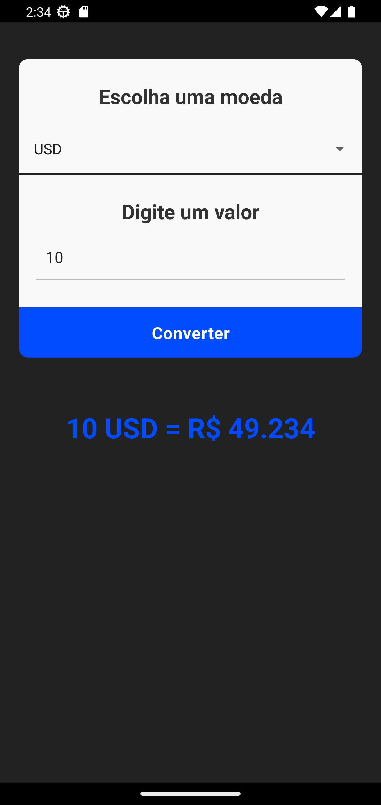

## Conversor de Moedas

Aplicativo Android desenvolvido em ReactNative.

O Conversor de Moedas é um aplicativo inteligente e eficiente que permite realizar conversões instantâneas e precisas entre diferentes moedas do mundo para o Real Brasileiro. Com uma interface intuitiva e fácil de usar.

Foi utilizado:

- https://docs.awesomeapi.com.br/ - API de cotações para conversão de moedas.

Existe a necessidade de melhorias, mas é algo simples e fácil de usar, fique a vontade para fazer melhorias ;)

 
 

